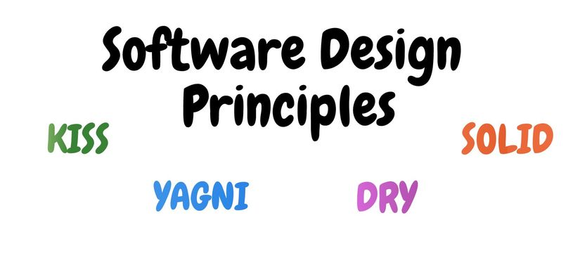

<h1 align="center">
   
  
   
   
  Design Principles
   
   
</h1>

## Table of Contents

* **[SOLID](#SOLID)**
* **[KISS](#KISS)**
* **[YAGNI](#YAGNI)**
* **[DRY](#DRY)**

---

## SOLID

* [The S.O.L.I.D Principles in Pictures](https://medium.com/backticks-tildes/the-s-o-l-i-d-principles-in-pictures-b34ce2f1e898)
* [SOLID Principles : The Definitive Guide](https://medium.com/android-news/solid-principles-the-definitive-guide-75e30a284dea)
* [SOLID Principles-simple and easy explanation](https://betterprogramming.pub/solid-principles-simple-and-easy-explanation-f57d86c47a7f)
* [The SOLID Principles of Object-Oriented Programming Explained in Plain English](https://www.freecodecamp.org/news/solid-principles-explained-in-plain-english/)
* [SOLID: The First 5 Principles of Object Oriented Design](https://www.digitalocean.com/community/conceptual_articles/s-o-l-i-d-the-first-five-principles-of-object-oriented-design)
* [A Solid Guide to SOLID Principles](https://www.baeldung.com/solid-principles)
* [S.O.L.I.D. Principles: Simplified Explanation & Example](https://medium.com/tunaiku-tech/s-o-l-i-d-principles-simplified-explanation-example-f7268ca75758)
* [SOLID Principles — explained with examples](https://medium.com/mindorks/solid-principles-explained-with-examples-79d1ce114ace)
* [The SOLID Principles: a Guide for Object-Oriented Design](https://www.datascienceblog.net/post/programming/object-oriented-design-solid-principles/)

**[🡱 Back to Top 🡱](#table-of-contents)**

---

## KISS

**[🡱 Back to Top 🡱](#table-of-contents)**

---

## YAGNI

**[🡱 Back to Top 🡱](#table-of-contents)**

---

## DRY

**[🡱 Back to Top 🡱](#table-of-contents)**